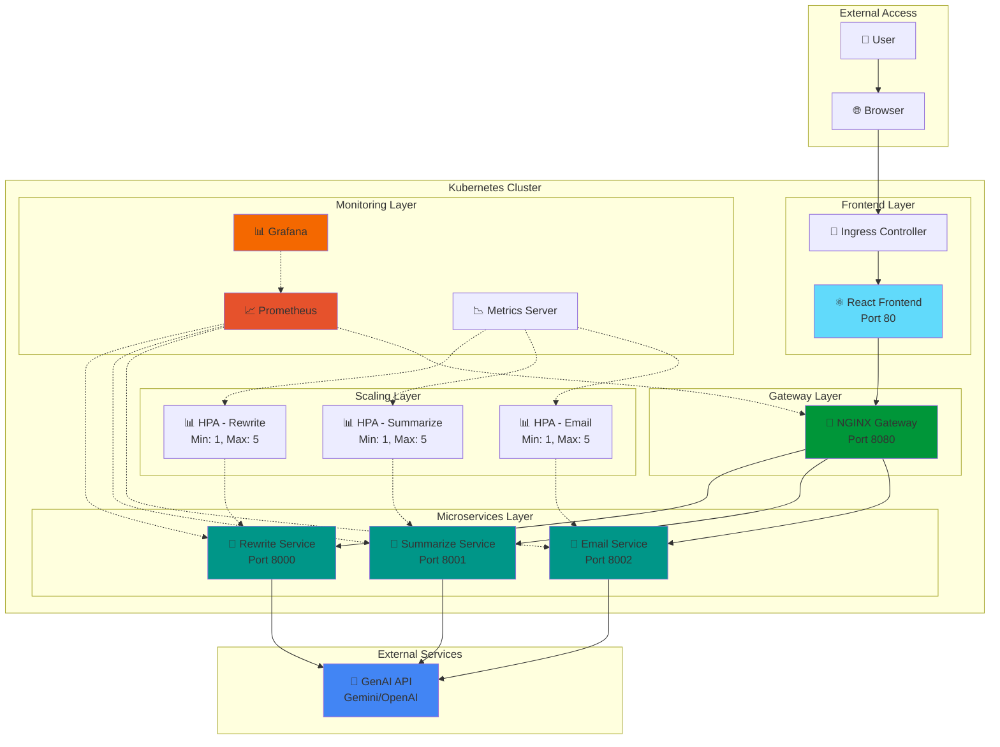

<div align="center">

# 🚀 GenAI Prompt Enhancer

[](https://github.com/Sandarsh18/genai-prompt-enhancer/stargazers)
[](https://github.com/Sandarsh18/genai-prompt-enhancer/network/members)
[](https://github.com/Sandarsh18/genai-prompt-enhancer/issues)
[](https://github.com/Sandarsh18/genai-prompt-enhancer/pulls)
[](LICENSE)
[](CONTRIBUTING.md)
[](CODE_OF_CONDUCT.md)

<p align="center">
  
  
  
  
  
  
  
  
  
  
</p>

<h3>Production-Ready Cloud-Native GenAI Platform</h3>

<p align="center">
Transform your text with AI-powered rewriting, summarization, and email drafting through a fully orchestrated Kubernetes microservices architecture with auto-scaling and complete observability.
</p>

<p align="center">
  <a href="#-features">Features</a> •
  <a href="#-architecture">Architecture</a> •
  <a href="#-quick-start">Quick Start</a> •
  <a href="#-kubernetes-deployment">Kubernetes</a> •
  <a href="#-monitoring--observability">Monitoring</a> •
  <a href="#-auto-scaling-demo">Auto-Scaling</a> •
  <a href="#-screenshots">Screenshots</a> •
  <a href="#-contributing">Contributing</a>
</p>

---

</div>

## ✨ Features

<table>
<tr>
<td>

### 🎯 Core Capabilities
- 🔄 **AI-Powered Text Rewriting** - Enhance and improve text quality
- 📝 **Smart Summarization** - Condense long content intelligently  
- 📧 **Email Generation** - Draft professional emails instantly
- 🌐 **Modern React UI** - Beautiful, responsive user interface
- ⚡ **Real-time Processing** - Fast API responses

</td>
<td>

### 🏗️ Infrastructure
- ☸️ **Kubernetes Native** - Full container orchestration
- 📈 **Auto-Scaling** - HPA-based dynamic scaling
- 🔍 **Observability** - Prometheus + Grafana monitoring
- 🔐 **Security** - ConfigMaps, Secrets, health checks
- 🚀 **CI/CD Ready** - GitHub Actions pipelines

</td>
</tr>
</table>

---

## 🏛️ Architecture



### 🎯 System Flow

```
┌─────────────┐
│   User      │
│  Request    │
└──────┬──────┘
       │
       ▼
┌─────────────────────────────────────────┐
│          Kubernetes Ingress             │
│         (genai.local)                   │
└──────┬──────────────────────────────────┘
       │
       ▼
┌─────────────────────────────────────────┐
│        NGINX API Gateway                │
│    (Load Balancing + Routing)           │
└──┬─────────┬──────────┬─────────────────┘
   │         │          │
   │         │          │
   ▼         ▼          ▼
┌──────┐ ┌──────┐  ┌──────┐
│Rewrite│ │Summ. │  │Email │
│Service│ │Service│  │Service│
│ HPA  │ │ HPA  │  │ HPA  │
└───┬──┘ └───┬──┘  └───┬──┘
    │        │         │
    └────────┴─────────┘
             │
             ▼
    ┌────────────────┐
    │ Prometheus     │
    │ + Grafana      │
    │ (Observability)│
    └────────────────┘
```

---

## 📦 Components

| Component | Technology | Purpose | Port |
|-----------|------------|---------|------|
| 🎨 **Frontend** | React + Vite | Modern SPA with responsive UI | 80 |
| 🔀 **NGINX Gateway** | NGINX Alpine | Reverse proxy, load balancing | 8080 |
| 🔄 **Rewrite Service** | FastAPI + Python 3.12 | Text enhancement with GenAI | 8000 |
| 📝 **Summarize Service** | FastAPI + Python 3.12 | Intelligent text summarization | 8001 |
| 📧 **Email Service** | FastAPI + Python 3.12 | Professional email drafting | 8002 |
| 📊 **HPA** | Kubernetes | Auto-scaling (CPU-based) | - |
| 📈 **Prometheus** | Helm Chart | Metrics collection & storage | 9090 |
| 📊 **Grafana** | Helm Chart | Metrics visualization | 3000 |

---

## 🚀 Quick Start

### Prerequisites

```bash
# Required
✓ Docker 20+
✓ Kubernetes (Minikube/Kind/K3s)
✓ kubectl
✓ Helm 3+
✓ Python 3.12+
✓ Node.js 20+

# Optional
✓ hey (load testing)
✓ GitHub CLI (gh)
```

### 🏃‍♂️ Local Development (Docker)

**1️⃣ Clone & Setup**

```bash
git clone https://github.com/Sandarsh18/genai-prompt-enhancer.git
cd genai-prompt-enhancer
cp .env.example .env
```

**2️⃣ Configure API Key**

Edit `.env` and add your GenAI API key:

```bash
GENAI_PROVIDER=gemini  # or openai
GENAI_MODEL=gemini-1.5-flash
GENAI_API_KEY=your_api_key_here  # Get from https://aistudio.google.com/apikey
```

**3️⃣ Start All Services**

```bash
# Install dependencies
make install

# Start all services (runs in background)
./start-dev.sh

# Check status
./status.sh
```

**4️⃣ Access the Application**

| Service | URL | Description |
|---------|-----|-------------|
| 🌐 Frontend | http://localhost:5173 | Web UI |
| 🔀 Gateway | http://localhost:8088 | API Gateway |
| 📚 API Docs | http://localhost:8000/docs | OpenAPI Docs |

---

## ☸️ Kubernetes Deployment

### Setup Minikube Cluster

```bash
# Start Minikube
minikube start --cpus=4 --memory=8192

# Enable addons
minikube addons enable ingress
minikube addons enable metrics-server

# Configure Docker to use Minikube
eval $(minikube docker-env)
```

### Build & Deploy to Kubernetes

```bash
# Build Docker images
docker build -t rewrite-service:latest ./rewrite-service
docker build -t summarize-service:latest ./summarize-service
docker build -t email-service:latest ./email-service
docker build -t genai-gateway:latest ./nginx-gateway
docker build -t frontend:latest ./frontend

# Create ConfigMap (edit k8s/configmap.yaml first)
kubectl apply -f k8s/configmap.yaml

# Deploy all services
kubectl apply -f k8s/

# Verify deployment
kubectl get pods
kubectl get svc
kubectl get hpa
```

### Access the Application

```bash
# Get service URLs
minikube service list

# Port-forward for local access
kubectl port-forward svc/frontend 30080:80 &
kubectl port-forward svc/nginx-gateway 32080:8080 &

# Access
# Frontend: http://localhost:30080
# Gateway: http://localhost:32080
```

---

## 📊 Monitoring & Observability

### Install Prometheus & Grafana

```bash
# Add Helm repo
helm repo add prometheus-community https://prometheus-community.github.io/helm-charts
helm repo update

# Install monitoring stack
helm install prometheus prometheus-community/kube-prometheus-stack \
  --namespace monitoring \
  --create-namespace \
  --set prometheus.prometheusSpec.serviceMonitorSelectorNilUsesHelmValues=false

# Wait for pods
kubectl get pods -n monitoring -w
```

### Access Monitoring Dashboards

**Prometheus:**
```bash
kubectl port-forward -n monitoring svc/prometheus-kube-prometheus-prometheus 9090:9090
# Open: http://localhost:9090
```

**Grafana:**
```bash
kubectl port-forward -n monitoring svc/prometheus-grafana 3000:80

# Get password
kubectl get secret -n monitoring prometheus-grafana \
  -o jsonpath="{.data.admin-password}" | base64 --decode

# Open: http://localhost:3000
# Username: admin
```

### 📈 Key Metrics to Monitor

- **CPU Usage**: `rate(container_cpu_usage_seconds_total{namespace="default"}[5m])`
- **Memory Usage**: `container_memory_usage_bytes{namespace="default"}`
- **HTTP Requests**: `rate(http_requests_total[5m])`
- **Pod Replicas**: `kube_deployment_status_replicas{namespace="default"}`

---

## 🔄 Auto-Scaling Demo

### Trigger HPA Scaling

```bash
# Watch HPA in real-time
kubectl get hpa -w

# Generate load (new terminal)
while true; do 
  curl -X POST http://$(minikube ip):32080/rewrite \
    -H "Content-Type: application/json" \
    -d '{"text":"test"}' & 
  sleep 0.1
done

# Observe scaling
# You'll see replicas increase: 1 → 2 → 3 → 4
```

### HPA Configuration

| Service | Min Pods | Max Pods | CPU Target | Scale Up | Scale Down |
|---------|----------|----------|------------|----------|------------|
| Rewrite | 1 | 5 | 50% | When CPU > 50% | After 5 min < 50% |
| Summarize | 1 | 5 | 50% | When CPU > 50% | After 5 min < 50% |
| Email | 1 | 5 | 50% | When CPU > 50% | After 5 min < 50% |

---

## 🧪 Testing

### API Testing

```bash
# Test rewrite endpoint
curl -X POST http://localhost:8088/rewrite \
  -H "Content-Type: application/json" \
  -d '{"text":"make this sound professional","tone":"formal"}'

# Test summarize endpoint
curl -X POST http://localhost:8088/summarize \
  -H "Content-Type: application/json" \
  -d '{"text":"Very long text that needs to be summarized..."}'

# Test email endpoint
curl -X POST http://localhost:8088/email \
  -H "Content-Type: application/json" \
  -d '{"text":"schedule meeting for project review","recipient":"team"}'
```

### Load Testing

```bash
# Using hey (install: go install github.com/rakyll/hey@latest)
hey -n 1000 -c 50 -m POST \
  -H "Content-Type: application/json" \
  -d '{"text":"test load"}' \
  http://localhost:8088/rewrite
```

---

## 🔧 Configuration

### Environment Variables

| Variable | Description | Example |
|----------|-------------|---------|
| `GENAI_PROVIDER` | AI provider (gemini/openai) | `gemini` |
| `GENAI_MODEL` | Model name | `gemini-1.5-flash` |
| `GENAI_API_KEY` | API authentication key | `AIza...` |
| `GENAI_TIMEOUT` | Request timeout (seconds) | `12` |
| `LOG_LEVEL` | Logging level | `info` |

### Kubernetes Resources

**Resource Limits per Pod:**
```yaml
resources:
  requests:
    cpu: 100m
    memory: 128Mi
  limits:
    cpu: 500m
    memory: 256Mi
```

---

## 🚢 CI/CD Pipeline

### GitHub Actions Workflows

**Build Pipeline** (`.github/workflows/build.yml`):
- Builds Docker images
- Pushes to container registry
- Runs unit tests

**Deploy Pipeline** (`.github/workflows/deploy.yml`):
- Deploys to Kubernetes
- Runs health checks
- Rolls back on failure

### Setup CI/CD

```bash
# Add secrets to GitHub repo
gh secret set DOCKER_USERNAME
gh secret set DOCKER_PASSWORD
gh secret set KUBECONFIG_BASE64
```

---

## 📁 Project Structure

```
genai-prompt-enhancer/
├── 📁 ci-cd/                   # GitHub Actions workflows
├── 📁 email-service/           # Email generation microservice
│   ├── app.py
│   ├── Dockerfile
│   └── requirements.txt
├── 📁 frontend/                # React frontend application
│   ├── src/
│   ├── Dockerfile
│   └── package.json
├── 📁 k8s/                     # Kubernetes manifests
│   ├── *-deploy.yaml          # Deployments
│   ├── *-svc.yaml             # Services
│   ├── hpa-*.yaml             # Auto-scalers
│   ├── configmap.yaml         # Configuration
│   └── ingress.yaml           # Ingress rules
├── 📁 load-test/               # Load testing scripts
├── 📁 nginx-gateway/           # NGINX API Gateway
│   ├── nginx.local.conf       # Local dev config
│   ├── nginx.k8s.conf         # Kubernetes config
│   └── Dockerfile
├── 📁 rewrite-service/         # Text rewriting microservice
├── 📁 summarize-service/       # Summarization microservice
├── 📄 README.md                # This file
├── 📄 QUICKSTART.md            # Quick start guide
├── 🔧 Makefile                 # Development commands
├── 🚀 start-dev.sh             # Start all services
├── 🛑 stop-dev.sh              # Stop all services
└── 📊 status.sh                # Check service status
```

---

## 📸 Screenshots

See [screenshots and demos](docs/SCREENSHOTS.md) for visual walkthrough of the application, Kubernetes deployment, monitoring dashboards, and auto-scaling in action.

**Quick Preview:**

- ✅ Modern React UI with three AI features
- ✅ Kubernetes pods running and auto-scaling
- ✅ Prometheus & Grafana monitoring dashboards
- ✅ HPA scaling from 1 to 4 replicas under load
- ✅ Real-time metrics and performance graphs

## 📄 License

This project is licensed under the MIT License - see the [LICENSE](LICENSE) file for details.

## 📚 Documentation

Comprehensive documentation available:

- **[Architecture Overview](docs/ARCHITECTURE.md)** - System design and component details
- **[Deployment Guide](docs/DEPLOYMENT.md)** - Complete deployment instructions for all environments
- **[Screenshots & Demos](docs/SCREENSHOTS.md)** - Visual walkthrough and performance metrics
- **[Contributing Guide](CONTRIBUTING.md)** - How to contribute to the project
- **[Security Policy](SECURITY.md)** - Security best practices and reporting
- **[Changelog](CHANGELOG.md)** - Version history and updates
- **[Code of Conduct](CODE_OF_CONDUCT.md)** - Community guidelines
- **[Roadmap](ROADMAP.md)** - Future plans and feature requests

---

## 🤝 Contributing

We welcome contributions! Please read our [Contributing Guide](CONTRIBUTING.md) to get started.

**Quick Start:**

1. Fork the repository
2. Create your feature branch (`git checkout -b feature/AmazingFeature`)
3. Commit your changes (`git commit -m 'Add some AmazingFeature'`)
4. Push to the branch (`git push origin feature/AmazingFeature`)
5. Open a Pull Request

Please read our [Code of Conduct](CODE_OF_CONDUCT.md) before contributing.

---

## 📄 License

This project is licensed under the MIT License - see the LICENSE file for details.

---

## 🙏 Acknowledgments

- **FastAPI** - Modern Python web framework
- **Kubernetes** - Container orchestration
- **Prometheus & Grafana** - Monitoring stack
- **React** - Frontend framework
- **NGINX** - High-performance web server

---

## 📞 Support & Community

- 🐛 **Bug Reports**: [GitHub Issues](https://github.com/Sandarsh18/genai-prompt-enhancer/issues)
- 💬 **Discussions**: [GitHub Discussions](https://github.com/Sandarsh18/genai-prompt-enhancer/discussions)
- 📖 **Documentation**: [docs/](docs/)
- 🔒 **Security**: See [SECURITY.md](SECURITY.md)

**Found this helpful?**
- ⭐ Star this repository
- 🍴 Fork and contribute
- 📢 Share with others

---

<div align="center">

### ⭐ Star this repository if you find it helpful!

Made with ❤️ by [Sandarsh18](https://github.com/Sandarsh18)

</div>
   ```bash
   # Rewrite microservice
   cd rewrite-service && uvicorn app:app --reload --port 8000

   # Summarize microservice
   cd summarize-service && uvicorn app:app --reload --port 8001

   # Email microservice
   cd email-service && uvicorn app:app --reload --port 8002

   # Gateway (Docker)
    docker build -t genai-gateway ./nginx-gateway
    docker run --add-host host.docker.internal:host-gateway \  # needed on Linux
       -v $PWD/nginx-gateway/nginx.local.conf:/etc/nginx/nginx.conf:ro \
       -e GENAI_PROVIDER -e GENAI_MODEL -e GENAI_GEMINI_BASE_URL \
       -e GENAI_API_BASE_URL -e GENAI_API_KEY -p 8080:8080 genai-gateway

   # Frontend (points to gateway via Vite env var)
   cd frontend && VITE_GATEWAY_URL=http://localhost:8080 npm run dev
   ```
5. Visit `http://localhost:5173`, or directly hit the gateway (`curl -X POST http://localhost:8080/rewrite ...`).

## Docker Images
Each Dockerfile uses a slim runtime and multi-stage build. Example build commands:
```bash
# Frontend
cd frontend
npm install
DOCKER_BUILDKIT=1 docker build -t your-dockerhub/genai-frontend:latest .

# Rewrite microservice
cd ../rewrite-service
DOCKER_BUILDKIT=1 docker build -t your-dockerhub/genai-rewrite:latest .
```
Push the images to your registry so the Kubernetes manifests can pull them.

## Kubernetes Deployment
1. Create namespace (optional): `kubectl create namespace genai`.
2. Apply shared config + secrets after editing `k8s/configmap.yaml` with your API URL/model and replacing the secret value.
   ```bash
   kubectl apply -n genai -f k8s/configmap.yaml
   kubectl apply -n genai -f k8s
   ```
3. Update image references to match your registry (or patch via `kubectl set image`).
4. Expose ingress locally:
   ```bash
   kubectl port-forward svc/nginx-gateway 8080:8080 -n genai
   kubectl port-forward svc/frontend 3000:80 -n genai
   ```
5. Map `genai.local` to `127.0.0.1` in `/etc/hosts`, then browse to `https://genai.local` via your ingress controller.

## Horizontal Pod Autoscaling Demo
1. Ensure the HPAs (`k8s/hpa-*.yaml`) are applied and the metrics server is available.
2. Run sustained load:
   ```bash
   cd load-test
   chmod +x hey-load.sh
   ./hey-load.sh http://<node-ip>:32080/rewrite
   ```
3. Watch scaling events:
   ```bash
   kubectl get hpa -n genai --watch
   kubectl top pods -n genai
   ```

## Observability Stack
Install the kube-prometheus-stack chart (Prometheus, Alertmanager, Grafana, node exporter, kube-state-metrics):
```bash
helm repo add prometheus-community https://prometheus-community.github.io/helm-charts
helm repo update
helm install monitoring prometheus-community/kube-prometheus-stack -n monitoring --create-namespace
```
Key Grafana dashboards to import:
- *Kubernetes / Compute Resources / Pod*
- *Horizontal Pod Autoscaler*
- *NGINX Overview* (ID 12708)

Expose Grafana locally:
```bash
kubectl port-forward svc/monitoring-grafana 3001:80 -n monitoring
```
Set `http://localhost:3001` → Dashboards → Import ID. Capture screenshots and store under `docs/` (placeholder references in this README: `docs/grafana-hpa.png`, `docs/grafana-nginx.png`).

## CI/CD
1. **Build Pipeline (`ci-cd/build.yml`)**
   - Triggers on pushes to `main`.
   - Matrix builds/pushes Docker images for frontend, microservices, and gateway using Docker Buildx.
2. **Deploy Pipeline (`ci-cd/deploy.yml`)**
   - Triggers on manual dispatch or manifest changes.
   - Loads kubeconfig from `KUBE_CONFIG_BASE64` secret.
   - Applies manifests, sets images to the latest commit SHA, and waits for rollouts.

Prepare GitHub repository secrets:
- `DOCKERHUB_USERNAME`, `DOCKERHUB_TOKEN`
- `KUBE_CONFIG_BASE64` (base64-encoded kubeconfig with deploy permissions)

## Testing
- **API Smoke Tests:**
  ```bash
  curl -X POST http://localhost:32080/rewrite -H 'Content-Type: application/json' -d '{"text":"make this sharper"}'
  ```
- **Frontend E2E:** Use Playwright/Cypress to automate button clicks and response rendering checks.
- **Load Testing:** Use `load-test/hey-load.sh` to generate CPU pressure and validate HPA + Prometheus metrics.

## Troubleshooting
- Pods pending → run `kubectl describe pod/<name>` for scheduling issues (CPU/memory requests too high?).
- 502 errors from gateway → verify downstream services are healthy; check `kubectl logs deployment/nginx-gateway` for proxy failures.
- Prometheus scrape failures → ensure `prometheus-fastapi-instrumentator` exposes `/metrics` (enabled by default) and ServiceMonitors target the right namespace.
- HPAs not scaling → confirm metrics-server or kube-prometheus-stack is healthy via `kubectl top nodes`.
- GitHub Actions image pulls failing → confirm Docker Hub rate limits and credentials, or switch to GHCR + PAT.

## TODO / Enhancements
- Add ServiceMonitor CRDs for each backend (post Helm install).
- Integrate API key rotation with external secret manager (Vault, SOPS).
- Extend CI with automated load tests before deployment.
